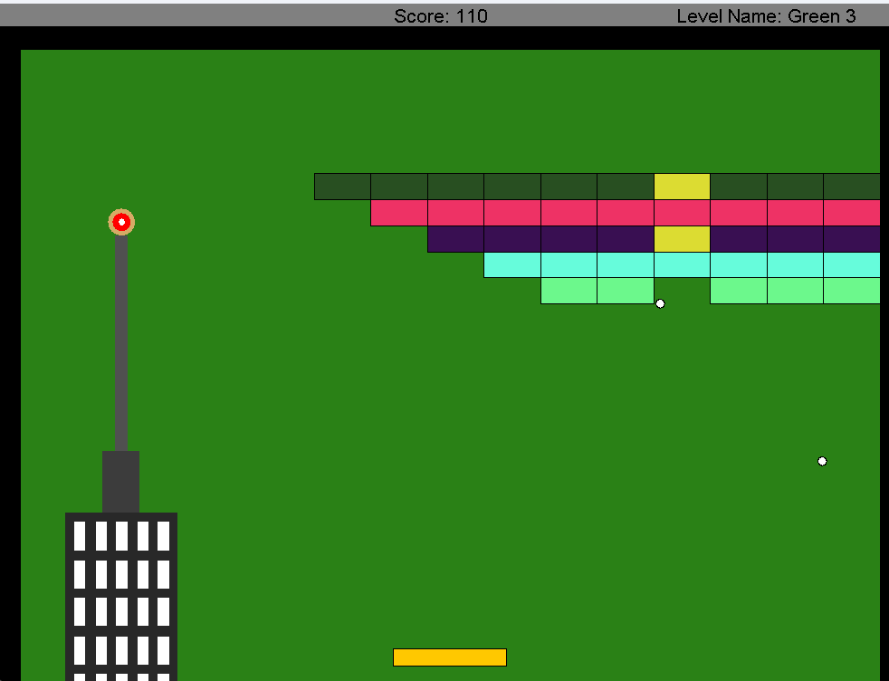
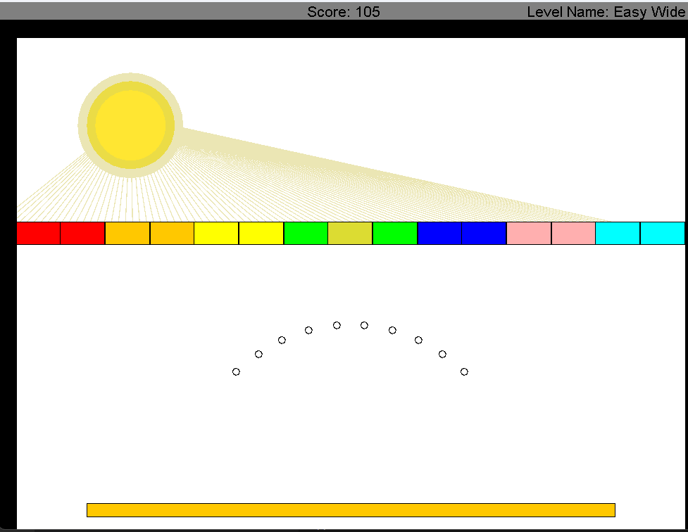

# 🎮 Arkanoid Game


## 🚀 Overview

This is a fully-featured implementation of the classic Arkanoid/Breakout arcade game, built using pure Java with a strong emphasis on Object-Oriented Programming principles. The game features multiple levels with increasing difficulty, dynamic physics, scoring system, and various game elements that create an engaging gaming experience.

## ✨ Features

- **Multiple Game Levels** - Three uniquely designed levels with different block patterns, speeds, and challenges
- **Dynamic Physics Engine** - Realistic ball movement and collision detection
- **Interactive Gameplay** - Responsive paddle control with keyboard input
- **Visual Effects** - Custom animations, including countdown and game transitions
- **Score Tracking** - Real-time score display and end-game results
- **Power-ups** - Special golden blocks that reward the player with extra balls
- **Game States** - Pause functionality, game over and victory screens

## 🏗️ Architecture & OOP Design

This project showcases advanced Object-Oriented Programming concepts:

### 🧩 Core OOP Principles

- **Encapsulation** - Each class maintains its own state and behavior with proper access modifiers
- **Inheritance** - Specialized game objects extend base classes
- **Polymorphism** - Interface implementations allow for diverse object behaviors
- **Abstraction** - Well-defined interfaces hide implementation details

### 📋 Design Patterns

- **Observer Pattern** - HitListener and HitNotifier interfaces for collision events
- **Strategy Pattern** - Different level implementations with the same interface
- **Builder Pattern** - BlocksBuilder class for constructing complex block arrangements
- **Decorator Pattern** - Enhanced functionality of basic game objects
- **MVC-inspired Architecture** - Separation of game logic, visual representation, and controls

### 🔄 Key Components

```
├── Animation System       // Manages game loop and rendering
├── Game Management        // Controls game flow and level transitions
├── Physics & Geometry     // Handles movement and collision detection
├── Event System           // Processes game events and notifications
├── Game Objects           // Implements balls, blocks, paddle, etc.
├── Levels                 // Defines different game stages
└── Scoring System         // Tracks player performance
```

## 🖼️ Class Structure

The project implements a comprehensive class hierarchy:

- **Game Objects**: `Ball`, `Block`, `Paddle`, `DeathBlock`
- **Geometry**: `Point`, `Line`, `Rectangle`, `Velocity`
- **Game Logic**: `GameLevel`, `GameFlow`, `GameEnvironment`
- **Animation**: `Animation` interface, `AnimationRunner`, `CountdownAnimation`
- **Listeners**: `HitListener`, `BlockRemover`, `BallRemover`, `ScoreTrackingListener`

## 🎯 Educational Value

This project demonstrates:

- Clean, maintainable code organization
- Interface-based design for flexibility
- Proper separation of concerns
- Event-driven programming
- Game development fundamentals

## 🚀 Getting Started

### Prerequisites
- Java Development Kit (JDK) 8 or higher
- The game uses the BIU OOP library (biuoop-1.4.jar)

### Running the Game

1. Clone this repository

2. Compile the Java files:
```bash
javac -cp biuoop-1.4.jar -d bin src\*.java src\animationRun\*.java src\animationRun\pause\*.java src\gamePlay\*.java src\gamePlay\collision\*.java src\gamePlay\gameSettings\*.java src\gamePlay\levels\*.java src\gamePlay\removing\*.java src\gamePlay\score\*.java src\gamePlay\screenDraw\*.java src\gamePlay\time\*.java src\generators\*.java src\geometry\axis\*.java src\geometry\objects\*.java src\runningTests\*.java
```

3. Run the main class:
```bash
java -cp "biuoop-1.4.jar;bin" Ass6Game
```

### Controls
- **←** and **→** arrow keys to move the paddle
- **p** to pause the game
- **SPACE** to continue after pause/game over

## 🖼️ Project screenshots

Below are two levels of the Game:

<div style="display:flex; gap:12px; align-items:center;">
	
	
</div>

## 🎓 About

This Arkanoid game was developed as a programming project that demonstrates strong Object-Oriented design principles and Java programming skills. The architecture allows for easy extension with new levels, game elements, or features.

---

*Developed by Roee Shlosberg*
